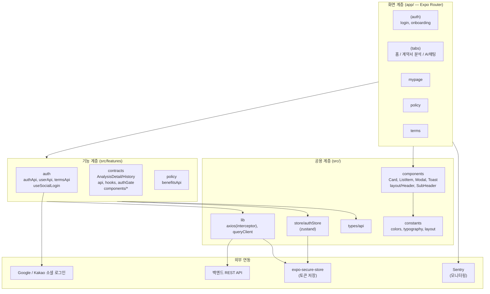
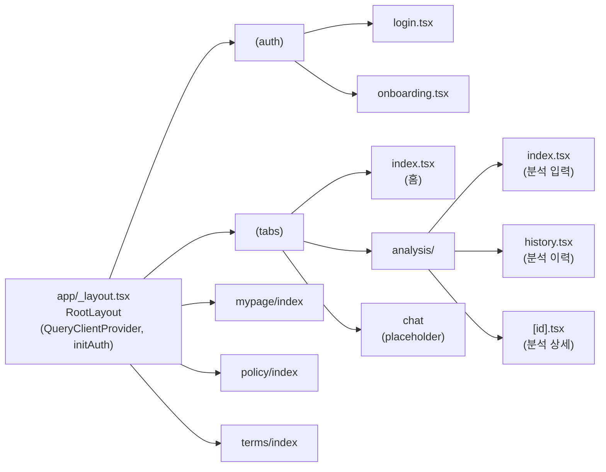
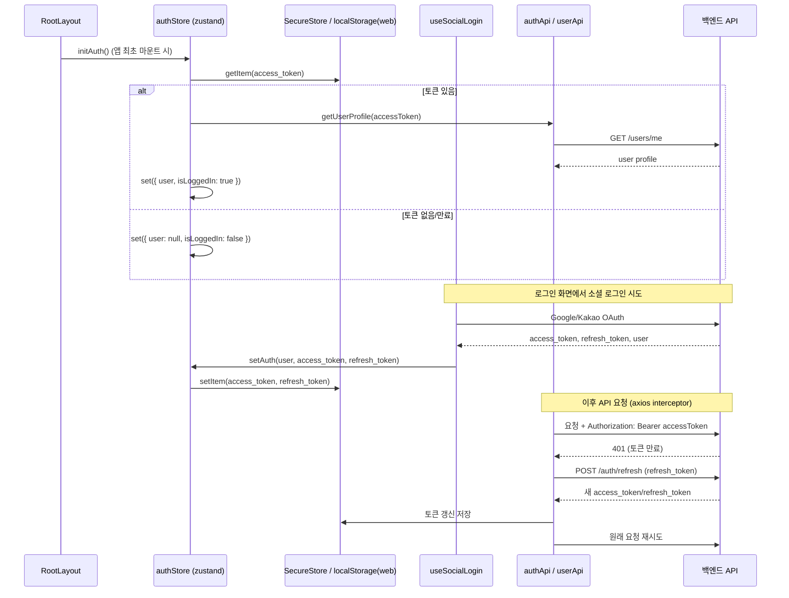
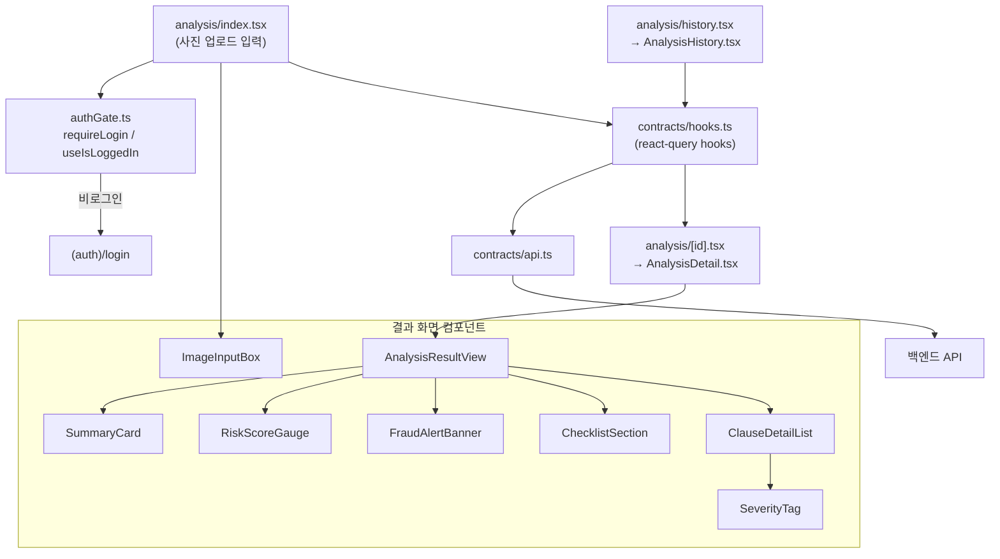

# 아키텍처 개요

drugIn-client (임대차 계약 관리 플랫폼) 의 클라이언트 아키텍처를 정리한 문서입니다.
아래 Mermaid 다이어그램은 [Mermaid Live Editor](https://mermaid.live) 등 Mermaid를 지원하는 도구에서
코드 블록을 붙여넣으면 바로 그림으로 렌더링할 수 있습니다.

## 1. 전체 레이어 구조

## 2. 라우팅 구조 (Expo Router)

## 3. 인증 플로우 (소셜 로그인 + 토큰 갱신)

## 4. 계약서 분석(contracts) 기능 흐름

## 참고

- 화면(라우트)은 `app/` 아래 Expo Router 파일 기반 라우팅을 따릅니다.
- 화면은 `src/features/*` 의 기능 컴포넌트/훅/API를 조립해서 사용합니다.
- 인증 토큰은 `src/store/authStore.ts` (zustand) 가 메모리 상태를, `expo-secure-store`(네이티브)/`localStorage`(web) 가 영속 저장을 담당합니다.
- API 요청은 `src/lib/axios.ts` 의 axios 인스턴스를 통하며, 401 응답 시 인터셉터가 자동으로 refresh token 흐름을 수행합니다.
- 서버 상태 캐싱/동기화는 `@tanstack/react-query` (`src/lib/queryClient.ts`) 로 처리합니다.
